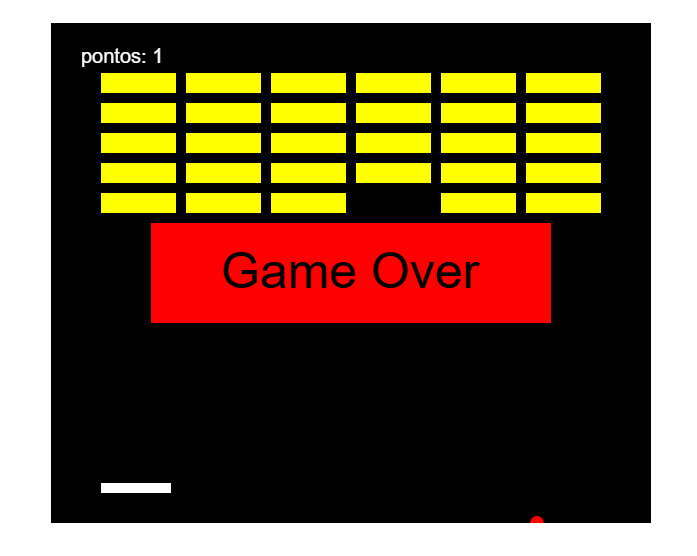

# jogoBreakout

Descrição: Breakout é um jogo clássico de arcade lançado em 1976. Nele, o jogador controla uma raquete na parte inferior da tela para rebater uma bola e quebrar blocos e pontuar. O objetivo é destruir todos os blocos sem deixar a bola cair.

Instruções

    Use "a" e "d" do teclado para movimentar a raquete.
    Destrua todos os blocos para conseguir pontos.
    Não deixe que a bola caia se não você terá um game over

